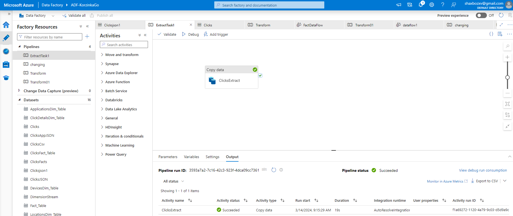
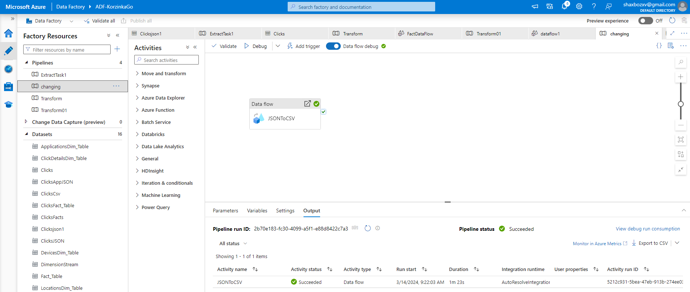
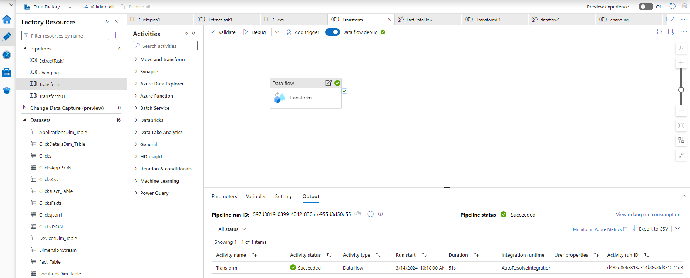
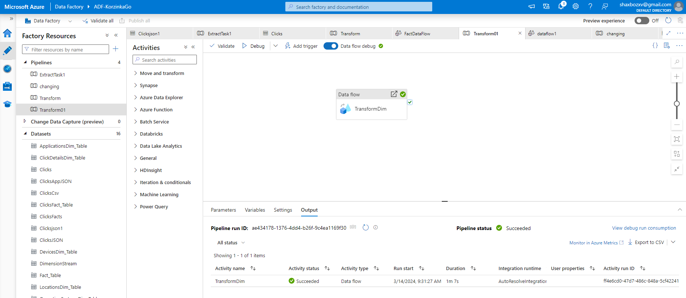
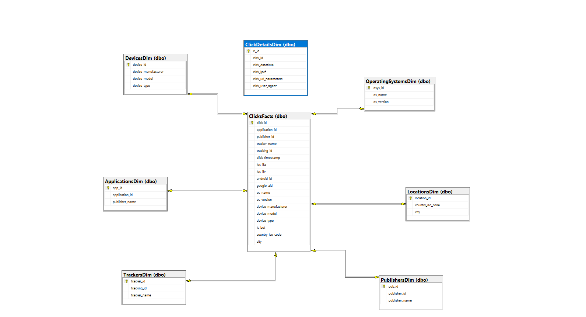

# KorzinkaGoTask_1
Design and implement a simple ETL pipeline for a simple dataset in JSON format.

# KorzinkaGoTask1
Design and implement a simple ETL pipeline for a simple dataset in JSON format.

<h1 align="center">Azure Data Engineering Project_01</h1>
<h2 align="left">Objective: Design and implement a simple ETL (Extract, Transform, Load) pipeline for a sample dataset:</h2>
<h3 align="left">Dataset:
A JSON file containing clicks in Application. You can access from this https://drive.google.com/file/d/1vbHELLhLzr5VaDiaeesDQ6BRsEoFd9lK/view?usp=sharing

Extract JSON file from Google Drive.
Transform and load JSON file into several tables. You have to define in which tables to store these files. 
Load the transformed data into a SQL database. (it can be Postgres, MySQL, SQLite)
Document your code and provide clear instructions on how to run the pipeline.
Show EER diagram and relations between tables.
Write short documentation of columns and tables.

Instructions:
Use a programming language of your choice (e.g., Python) and libraries that you are comfortable with (e.g., pandas, JSON parsing libraries, SQLite). You can also use any ETL framework (e.g. Airflow, NiFi)

Submit your code via a version control system (e.g., GitHub) and provide a README.md with explanations, any assumptions made, and instructions on how to run the pipeline.
</h3>

<h2 align="left">High Level Steps:</h2>
<h3 align="left">

**1. Visit link https://drive.google.com/file/d/1vbHELLhLzr5VaDiaeesDQ6BRsEoFd9lK/view?usp=sharing**

**2. Extract, Transform and Load data using Azure Data Factory**

**3. Convert JSON file into CSV for better use case**

**4. Split CSV file into fact and dimension tables (Star Schema for better performance)**

**5. Create Tables in SQL Sever

**5. Load data to those tables using pipeline**

**6. Show relations between tables and EER diagram**
</h3>

<h2 align="left">Prerequisite</h2>
<h3 align="left">

**- Azure account with active subscription**

**- Azure DataFactory Data factory (V2)**

**- Create SQL Server in Azure**

**- Knowledge about storage account, azure data factory, sql stc.**
</h3>

<h2 align="left">Complete Steps:</h2>
<h3 align="left">

**1. Using Copy Activity for Extracting Data form Google Drive**

**2. Converting Json file into Csv for better use cases**

**3. Transform and Load Fact Table into SQL Server**

**4. Transform and Load Dimension Tables into SQL Server**

**5. Relationship between tables**

**To view code how to create tables in SQL Server you can look into code section**
